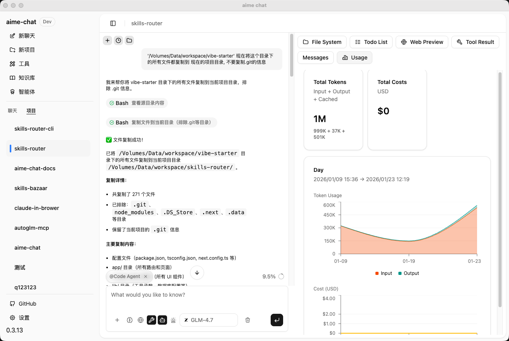

# AIME Chat

<div align="center">
  
  
  <p>
    <strong>A Powerful AI Desktop Chat Application</strong>
  </p>

  <p>
    
    
    
  </p>

  <p>
    🌐 <a href="https://darknoah.github.io/aime-chat/">Official Website</a>
  </p>

  <p>
    <a href="README_CN.md">中文</a> | <strong>English</strong>
  </p>
</div>

---

<div align="center">
  
</div>

## ✨ Features

- 🤖 **Multiple AI Provider Support** - Integrated with mainstream AI providers including OpenAI, DeepSeek, Google, Zhipu AI, MiniMax, Ollama, LMStudio, ModelScope, and more
- 💬 **Intelligent Conversations** - Powerful AI Agent system based on Mastra framework, supporting streaming responses and tool calling
- 🤝 **Open CoWork Capability** - AI is not just for chatting, it can perform actual operations like file editing, code execution, web searching, and more
- 📚 **Knowledge Base Management** - Built-in vector database with support for document retrieval and knowledge Q&A
- 🛠️ **Tool Integration** - Support for MCP (Model Context Protocol) client with extensible tool capabilities
- 🎙️ **Audio Processing** - Built-in Speech-to-Text (STT) and Text-to-Speech (TTS) powered by Qwen3-TTS models
- 🔍 **Skill System** - Search, import, and manage AI skills from Git repositories or the online skill marketplace
- 🎨 **Modern UI** - Built with shadcn/ui component library, supports light/dark theme switching
- 🌍 **Internationalization** - Built-in Chinese and English interfaces
- 🔒 **Local First** - Data stored locally for privacy protection
- ⚡ **High Performance** - Built on Electron for cross-platform native experience

## 🚀 Quick Start

### Prerequisites

- Node.js >= 22.x
- npm >= 10.x
- pnpm >= 10.x

### Install Dependencies

```bash
pnpm install
```

### Development Mode

Start the development server:

- Click on "Electron Main" in VSCode's debug panel to start debugging

The application will start in development mode with hot reload support.

### Build Application

Package desktop application:

```bash
pnpm package
```

Packaged applications will be generated in the `release/build` directory.

### macOS Installation Notes

Due to the app not being signed with an Apple Developer certificate, macOS Gatekeeper may prevent the app from running. If you see "App is damaged" or "Cannot be opened" error, please run the following command in Terminal:

```bash
# After mounting the DMG and copying to Applications
xattr -cr /Applications/aime-chat.app
```

Or right-click the app → hold Option key → click "Open".

## 📦 Project Structure

```
aime-chat/
├── assets/              # Static assets
│   ├── icon.png        # Application icon
│   ├── models.json     # AI model configurations
│   └── model-logos/    # Provider logos
├── src/
│   ├── main/           # Electron main process
│   │   ├── providers/  # AI provider implementations
│   │   ├── mastra/     # Mastra Agent and tools
│   │   ├── knowledge-base/ # Knowledge base management
│   │   ├── tools/      # Tool system
│   │   └── db/         # Database
│   ├── renderer/       # React renderer process
│   │   ├── components/ # UI components
│   │   ├── pages/      # Page components
│   │   ├── hooks/      # React Hooks
│   │   └── styles/     # Style files
│   ├── types/          # TypeScript type definitions
│   ├── entities/       # Data entities
│   └── i18n/           # Internationalization config
└── release/            # Build artifacts
```

## 🎯 Core Features

### AI Provider Configuration

Support for configuring multiple AI providers, each with independent settings:

- API Key
- API Endpoint
- Available model list
- Enable/Disable status

Supported providers include:

| Provider | Type | Description |
|----------|------|-------------|
| OpenAI | Cloud | GPT series models |
| DeepSeek | Cloud | DeepSeek series models |
| Google | Cloud | Gemini series models |
| Zhipu AI | Cloud | GLM series models |
| MiniMax | Cloud | MiniMax series models |
| Ollama | Local | Run open-source models locally |
| LMStudio | Local | Local model management tool |
| ModelScope | Cloud | ModelScope community models |
| SerpAPI | Cloud | Google Search API service |

### Knowledge Base Features

- 📄 Document upload and parsing
- 🔍 Vector storage and retrieval
- 💡 Intelligent Q&A based on knowledge base
- 📊 Knowledge base management interface

### Tool System

Rich built-in tools that AI Agents can call autonomously:

| Category | Tools | Description |
|----------|-------|-------------|
| File System | Bash, Read, Write, Edit, Grep, Glob | File read/write, search, edit operations |
| Code Execution | CodeExecution | Execute Python and Node.js code |
| Web Tools | Web Fetch, Web Search | Web scraping and search (with AI content summarization) |
| Image Processing | GenerateImage, EditImage, RMBG | Image generation, editing, and background removal |
| Vision Analysis | Vision | LLM-powered image recognition and analysis (with OCR integration) |
| OCR Recognition | PaddleOCR | Document and image text recognition (supports PDF/images) |
| Audio Processing | SpeechToText, TextToSpeech | Speech-to-text and text-to-speech (powered by Qwen3-TTS) |
| Database | LibSQL | Database query and management |
| Translation | Translation | Multi-language text translation |
| Task Management | TaskCreate, TaskGet, TaskList, TaskUpdate | Structured task creation, query, and status management |
| Information Extraction | Extract | Extract structured information from documents |

- 🔌 **MCP Protocol Support** - Extensible third-party tools
- ⚙️ **Tool Configuration UI** - Visual tool management and configuration
- 🔍 **Skill Marketplace** - Search and import skills from Git repositories or online marketplace (skills.sh)

## 🛠️ Tech Stack

### Frontend
- **Framework**: React 19 + TypeScript
- **UI Library**: shadcn/ui (based on Radix UI)
- **Styling**: Tailwind CSS
- **Routing**: React Router
- **State Management**: React Context + Hooks
- **Internationalization**: i18next
- **Markdown**: react-markdown + remark-gfm
- **Code Highlighting**: shiki

### Backend (Main Process)
- **Runtime**: Electron
- **AI Framework**: Mastra
- **Database**: TypeORM + better-sqlite3
- **Vector Storage**: @mastra/fastembed
- **AI SDK**: Vercel AI SDK

### Build Tools
- **Bundler**: Webpack 5
- **Compiler**: TypeScript + ts-loader
- **Hot Reload**: webpack-dev-server
- **App Packaging**: electron-builder

## Project Initialization

```bash
git clone https://github.com/DarkNoah/aime-chat.git
cd ./aime-chat
pnpm install

# Since pnpm disables postinstall scripts by default, if you encounter missing binary packages or similar issues, run:
pnpm approve-builds
```

## ⚙️ Configuration

### Optional Runtime Libraries

AIME Chat supports optional runtime libraries that can be installed from the Settings page:

| Runtime | Description |
|---------|-------------|
| PaddleOCR | OCR recognition engine based on PaddlePaddle, supports document structure analysis and text extraction from PDF/images |
| Qwen Audio | Audio processing engine based on Qwen3-TTS, supports speech recognition (ASR) and text-to-speech (TTS) |

These runtimes are managed via the built-in uv package manager and will be installed in the application data directory.

### Data Storage

Application data is stored by default in the system user directory:

- **macOS**: `~/Library/Application Support/aime-chat`
- **Windows**: `%APPDATA%/aime-chat`
- **Linux**: `~/.config/aime-chat`

## 🤝 Contributing

Issues and Pull Requests are welcome!

1. Fork this repository
2. Create a feature branch (`git checkout -b feature/AmazingFeature`)
3. Commit your changes (`git commit -m 'Add some AmazingFeature'`)
4. Push to the branch (`git push origin feature/AmazingFeature`)
5. Open a Pull Request

### Code Standards

- Use ESLint and Prettier to maintain consistent code style
- Follow TypeScript type specifications

## 📄 License

This project is licensed under the [MIT](LICENSE) License.

## 👨‍💻 Author

**Noah**
- Email: 781172480@qq.com

## 🙏 Acknowledgments

- [Electron](https://www.electronjs.org/)
- [React](https://react.dev/)
- [Mastra](https://mastra.ai/)
- [Vercel AI SDK](https://sdk.vercel.ai/)
- [shadcn/ui](https://ui.shadcn.com/)
- [Radix UI](https://www.radix-ui.com/)

## 🔗 Related Links

- [Official Website](https://darknoah.github.io/aime-chat/)
- [Issue Tracker](https://github.com/DarkNoah/aime-chat/issues)
- [Changelog](CHANGELOG.md)

---

<div align="center">
  <sub>Built with ❤️ by Noah</sub>
</div>

