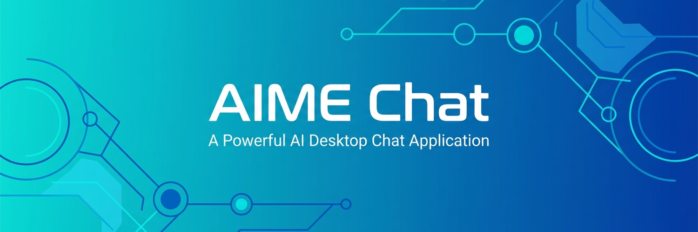
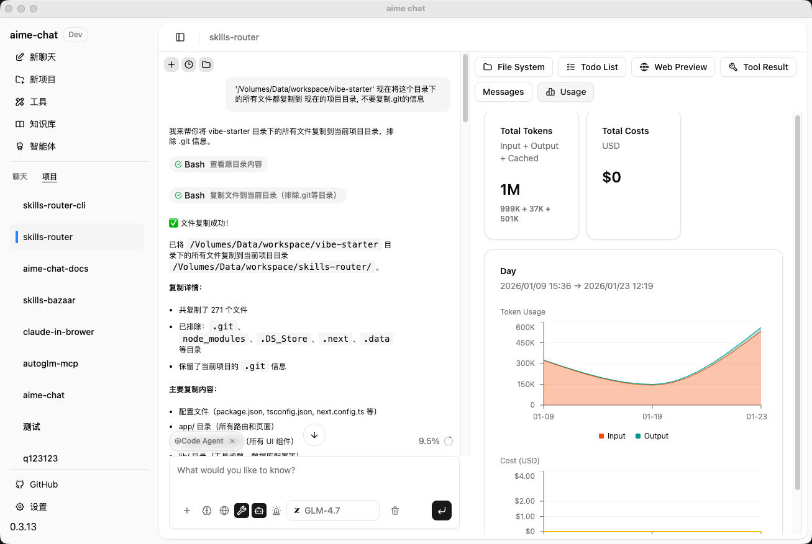

<div align="center">
  

  <p>
    
    
    
  </p>

  <p>
    <a href="https://darknoah.github.io/aime-chat/">Official Website</a> • <a href="README_CN.md">中文</a>
  </p>
</div>

---

<div align="center">
  
</div>

## ✨ Features

- 🦾 **Harness Engineering** - A complete agent harness around the model (Agent = Model + Harness): orchestration loop, tools, context & memory, sub-agents, guardrails, and observability turn a stateless model into a reliable, long-running agent
- 🤖 **Multiple AI Provider Support** - Integrated with mainstream AI providers including OpenAI, DeepSeek, Google, Zhipu AI, MiniMax, Ollama, LMStudio, ModelScope, and more
- 💬 **Intelligent Conversations** - Powerful AI Agent system based on Mastra framework, supporting streaming responses and tool calling
- 🤝 **Open CoWork Capability** - AI is not just for chatting: it can edit project files in an integrated workspace, execute code, search the web, and more
- 📚 **Knowledge Base Management** - Local knowledge bases with hybrid semantic/BM25 retrieval, optional reranking, source-text inspection, document/Excel parsing, and long-term cultivation memory
- 📤 **Project Chat Export** - Select project threads and export complete histories as Markdown, raw JSON, Excel, or Unsloth JSONL
- 🧠 **Cultivation Memory** - A scheduled Cultivation Agent extracts preferences, habits, project context, and important facts from chat history into a structured memory wiki
- ⏰ **Cron Automation** - Run scheduled AI tasks with project context, selectable agents/tools, and either reusable or per-run chat threads
- 🛠️ **Tool Integration** - Support for MCP (Model Context Protocol) client with extensible tool capabilities
- 🎙️ **Audio Processing** - Built-in Speech-to-Text (STT) and Text-to-Speech (TTS) powered by Qwen3-TTS models
- 🔍 **Skill System** - Search, import, and manage AI skills from Git repositories or the online skill marketplace
- 🧑‍💻 **Assistant Personalities** - Built-in assistant personalities can be selected instantly and customized through the current personality format
- 🖥️ **Background Bash Sessions** - Track long-running shell processes from the current chat or the whole project, with direct stop controls in the UI
- 🌐 **Browser Instances** - Detect Chrome, Edge, and Chromium; select the executable and browser profile used by an automation instance
- 📡 **Channel Integration** - Connect AI capabilities to messaging platforms like WeChat and Telegram
- 🔐 **Secrets Management** - Centrally manage credentials for tools and services and inject them into configured local workflows
- 🎨 **Customizable UI** - Choose light, dark, or system mode, set an accent color, and configure independent sidebar/chat backgrounds
- 🌍 **Internationalization** - Built-in Chinese and English interfaces
- 🔒 **Local First** - App state and chat data are stored locally by default; cloud providers still receive the requests you send to them
- ⚡ **High Performance** - Built on Electron for cross-platform native experience

## 🚀 Quick Start

### Prerequisites

- Node.js >= 22.x
- npm >= 10.x
- pnpm >= 10.x

### Install Dependencies

```bash
pnpm install
```

### Development Mode

Start the development server:

- Click **Electron: Main** in VSCode's debug panel (or **Electron: All** to attach both processes)

The application will start in development mode with hot reload support.

### Build Application

Package desktop application:

```bash
pnpm package
```

Packaged applications will be generated in the `release/build` directory.

### macOS Installation Notes

Due to the app not being signed with an Apple Developer certificate, macOS Gatekeeper may prevent the app from running. If you see "App is damaged" or "Cannot be opened" error, please run the following command in Terminal:

```bash
# After mounting the DMG and copying to Applications
xattr -cr /Applications/aime-chat.app
```

Or right-click the app → hold Option key → click "Open".

## 📦 Project Structure

```
aime-chat/
├── assets/              # Static assets
│   ├── icon.png        # Application icon
│   ├── models.json     # AI model configurations
│   └── model-logos/    # Provider logos
├── src/
│   ├── main/           # Electron main process
│   │   ├── providers/  # AI provider implementations
│   │   ├── mastra/     # Mastra Agent and tools
│   │   ├── knowledge-base/ # Knowledge base management
│   │   ├── tools/      # Tool system
│   │   └── db/         # Database
│   ├── renderer/       # React renderer process
│   │   ├── components/ # UI components
│   │   ├── pages/      # Page components
│   │   ├── hooks/      # React Hooks
│   │   └── styles/     # Style files
│   ├── types/          # TypeScript type definitions
│   ├── entities/       # Data entities
│   └── i18n/           # Internationalization config
└── release/            # Build artifacts
```

## 🎯 Core Features

### Harness Engineering

A raw LLM is just a stateless function — it becomes a dependable agent only when wrapped in a **harness**. Following the `Agent = Model + Harness` formula that the industry formalized in 2026, AIME Chat is built as a complete harness around the model, not just a chat box in front of it.

The harness layers AIME Chat provides:

| Layer | What it does | In AIME Chat |
|-------|--------------|--------------|
| Orchestration Loop | Drives the prompt → response → tool call → observation → next step cycle until a task is done | Mastra-based Agent runtime with streaming and multi-step tool calling |
| Guides | Feed-forward constraints that steer behavior | Agent instructions, assistant personalities, and the Skill system |
| Tool Interfaces | Scoped access to the outside world with clear schemas | Bash, Read/Write/Edit, Grep/Glob, Code Execution, Web, Vision, OCR, and MCP tools |
| Context & Memory | Assembling and persisting the right information across turns and sessions | Knowledge base, cultivation memory wiki, and session/working memory |
| Orchestration & Sub-agents | Delegating and coordinating specialized agents | Sub-agent configuration and multi-agent workflows |
| State & Long-running Tasks | Durable state so work survives across runs | Background Bash sessions, Goal-driven execution, and Cron automation |
| Guardrails & Permissions | Enforcing what the agent is allowed to do | Per-agent tool permissions, action approval, and centralized Secrets management |
| Observability | Tracing behavior for debugging and trust | Detailed runtime logging with direct log access from the About page |

In short, AIME Chat focuses on engineering everything *around* the model so that any provider — cloud or local — can be turned into a reliable, goal-directed agent.

### AI Provider Configuration

Support for configuring multiple AI providers, each with independent settings:

- API Key
- API Endpoint
- Available model list
- Enable/Disable status

Supported providers include:

| Provider | Type | Description |
|----------|------|-------------|
| OpenAI | Cloud | GPT series models |
| DeepSeek | Cloud | DeepSeek series models |
| Google | Cloud | Gemini series models |
| Zhipu AI | Cloud | GLM series models |
| MiniMax | Cloud | MiniMax series models |
| Ollama | Local | Run open-source models locally |
| LMStudio | Local | Local model management tool |
| ModelScope | Cloud | ModelScope community models |
| SerpAPI | Cloud | Google Search API service |

### Knowledge Base Features

- 📄 Import text, Markdown, PDF, Word, Excel, PowerPoint, and OCR-readable images
- 🔍 Hybrid semantic and BM25 full-text retrieval, with BM25-only operation when no embedding model is configured
- 🎯 Optional reranking and safe full-index rebuilding when changing the embedding model
- 📖 Inspect the original source after retrieval; long sources support pattern search and paginated reading
- 💡 Intelligent Q&A based on knowledge base
- 🧠 Cultivation memory that maintains a global memory wiki from chat history
- 📊 Knowledge base management interface

### Cultivation Memory

AIME Chat includes a global memory knowledge base maintained by the built-in `Cultivation` Agent. When the `Cultivation Daily` cron task is enabled, it reads newly updated user conversations, filters out automation-generated threads, deduplicates against existing memories, and writes useful long-term information into Markdown pages such as `preferences.md`, `habits.md`, and project notes.

This helps future conversations automatically inherit stable preferences, working habits, important people/entities, and ongoing project context without pasting old chat logs into every prompt.

### Tool System

Rich built-in tools that AI Agents can call autonomously:

| Category | Tools | Description |
|----------|-------|-------------|
| File System | Bash, Read, Write, Edit, Grep, Glob | File read/write, search, edit operations |
| Code Execution | CodeExecution | Execute Python code with optional programmatic tool calling |
| Web Tools | Web Fetch, Web Search | Web scraping and search (with AI content summarization) |
| Image Processing | GenerateImage, EditImage, RMBG | Image generation, editing, and background removal |
| Vision Analysis | Vision | LLM-powered image recognition and analysis (with OCR integration) |
| OCR Recognition | PaddleOCR | Document and image text recognition (supports PDF/images) |
| Audio Processing | SpeechToText, TextToSpeech | Speech-to-text and text-to-speech (powered by Qwen3-TTS) |
| Database | LibSQL | Database query and management |
| Translation | Translation | Multi-language text translation |
| Task Management | TaskCreate, TaskGet, TaskList, TaskUpdate | Structured task creation, query, and status management |
| Information Extraction | Extract | Extract structured information from documents |
| Knowledge Base | KnowledgeBase | Knowledge base retrieval and intelligent Q&A |

- 🧵 **Background Bash Tracking** - Long-running Bash sessions are visible from task/context surfaces, including project-wide sessions when a chat is bound to a project
- 🔌 **MCP Protocol Support** - Extensible third-party tools
- ⚙️ **Tool Configuration UI** - Visual tool management and configuration
- 🔍 **Skill Marketplace** - Search and import skills from Git repositories or online marketplace (skills.sh)

### Channel Integration

Connect AI capabilities to external messaging platforms:

| Channel | Description |
|---------|-------------|
| WeChat | Connect to WeChat for AI-powered conversations |
| Telegram | Integrate with Telegram bots for AI interaction |

### Secrets Management

Centralized management of secret keys and credentials used by tools and services:

- 🔑 Unified interface for managing API keys and tokens
- 💾 Values are stored in the local application database; protect your OS account, database, and backups
- 🔗 Automatic injection into tools that require authentication

## 🛠️ Tech Stack

### Frontend
- **Framework**: React 19 + TypeScript
- **UI Library**: shadcn/ui (based on Radix UI)
- **Styling**: Tailwind CSS
- **Routing**: React Router
- **State Management**: React Context + Hooks
- **Internationalization**: i18next
- **Markdown**: react-markdown + remark-gfm
- **Code Highlighting**: shiki

### Backend (Main Process)
- **Runtime**: Electron
- **AI Framework**: Mastra
- **Database**: TypeORM + better-sqlite3
- **Vector & Full-text Storage**: LibSQL
- **Embeddings**: Configurable local or provider-backed embedding models
- **AI SDK**: Vercel AI SDK

### Build Tools
- **Bundler**: Webpack 5
- **Compiler**: TypeScript + ts-loader
- **Hot Reload**: webpack-dev-server
- **App Packaging**: electron-builder

## Project Initialization

```bash
git clone https://github.com/DarkNoah/aime-chat.git
cd ./aime-chat
pnpm install

# Since pnpm disables postinstall scripts by default, if you encounter missing binary packages or similar issues, run:
pnpm approve-builds
```

## ⚙️ Configuration

### Optional Runtime Libraries

AIME Chat supports optional runtime libraries that can be installed from the Settings page:

| Runtime | Description |
|---------|-------------|
| UV / Python | Python runtime used by code execution, OCR, and other local processing tools |
| Node.js / Bun | JavaScript runtimes used by MCP servers and other workflows that invoke them |
| PaddleOCR | OCR recognition engine based on PaddlePaddle, supports document structure analysis and text extraction from PDF/images |
| Qwen Audio | Audio processing engine based on Qwen3-TTS, supports speech recognition (ASR) and text-to-speech (TTS) |

These runtimes are installed under the application data directory. Runtime install attempts write detailed success and failure information to the application log, and the About page provides a direct entry for opening the log file.

The Bash tool can use either AIME Chat's independent Python runtime (recommended) or the system Python runtime. Configure this per tool when an Agent needs packages or environment behavior from a specific Python installation.

### Appearance and Browser Instances

- Open **Settings → Appearance** to choose the theme mode and accent color, or add separate JPG/PNG/WebP backgrounds for the sidebar and chat area. Background opacity and blur can be adjusted independently.
- Open **Settings → Instances** to select an installed Google Chrome, Microsoft Edge, or Chromium executable, choose a detected or custom user-data directory, and configure the debug port or headless mode.

### Data Storage

Application data is stored by default in the system user directory:

- **macOS**: `~/Library/Application Support/aime-chat`
- **Windows**: `%APPDATA%/aime-chat`
- **Linux**: `~/.config/aime-chat`

## 🤝 Contributing

Issues and Pull Requests are welcome!

1. Fork this repository
2. Create a feature branch (`git checkout -b feature/AmazingFeature`)
3. Commit your changes (`git commit -m 'Add some AmazingFeature'`)
4. Push to the branch (`git push origin feature/AmazingFeature`)
5. Open a Pull Request

### Code Standards

- Use ESLint and Prettier to maintain consistent code style
- Follow TypeScript type specifications

## 📄 License

This project is licensed under the [MIT](LICENSE) License.

## 👨‍💻 Author

**Noah**
- Email: 781172480@qq.com

## 🙏 Acknowledgments

- [Electron](https://www.electronjs.org/)
- [React](https://react.dev/)
- [Mastra](https://mastra.ai/)
- [Vercel AI SDK](https://sdk.vercel.ai/)
- [shadcn/ui](https://ui.shadcn.com/)
- [Radix UI](https://www.radix-ui.com/)

## 🔗 Related Links

- [Official Website](https://darknoah.github.io/aime-chat/)
- [Issue Tracker](https://github.com/DarkNoah/aime-chat/issues)
- [Releases and Changelog](https://github.com/DarkNoah/aime-chat/releases)

---

<div align="center">
  <sub>Built with ❤️ by Noah</sub>
</div>
