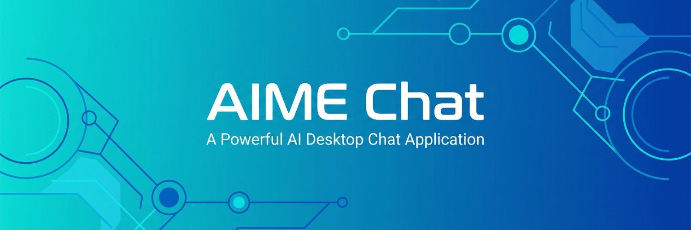
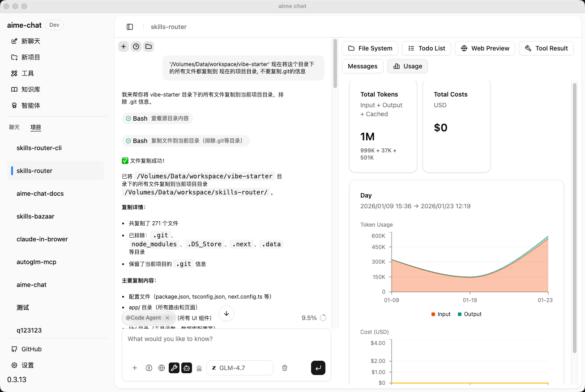

<div align="center">
  

  <p>
    
    
    
  </p>

  <p>
    <a href="https://darknoah.github.io/aime-chat/">官方网站</a> • <a href="README.md">English</a>
  </p>
</div>

---

<div align="center">
  
</div>

## ✨ 功能特性

- 🤖 **多 AI 提供商支持** - 集成 OpenAI、DeepSeek、Google、智谱 AI、Ollama、LMStudio、ModelScope、MiniMax 等多个主流 AI 提供商
- 💬 **智能对话** - 基于 Mastra 框架的强大 AI Agent 系统，支持流式响应和工具调用
- 🤝 **Open CoWork 能力** - AI 不只是聊天，还能执行实际操作，如文件编辑、代码执行、网络搜索等
- 📚 **知识库管理** - 内置向量数据库，支持文档检索和知识问答
- 🛠️ **工具集成** - 支持 MCP（Model Context Protocol）客户端，可扩展各类工具能力
- 🎙️ **语音处理** - 内置语音转文字（STT）和文字转语音（TTS）能力，基于 Qwen3-TTS 模型
- 🔍 **Skill 技能系统** - 支持从 Git 仓库或在线技能市场搜索、导入和管理 AI 技能
- 🎨 **现代化 UI** - 使用 shadcn/ui 组件库，支持亮色/暗色主题切换
- 🌍 **国际化支持** - 内置中文和英文界面
- 🔒 **本地优先** - 数据存储在本地，保护隐私安全
- ⚡ **高性能** - 基于 Electron 构建，跨平台原生体验

## 🚀 快速开始

### 前置要求

- Node.js >= 22.x
- npm >= 10.x
- pnpm >= 10.x

### 安装依赖

```bash
pnpm install
```

### 开发模式

启动开发服务器：

- 点击VSCode中调试界面的Electron Main开始运行调试

应用将在开发模式下启动，支持热重载。

### 打包应用

打包桌面应用：

```bash
pnpm package
```

打包后的应用将生成在 `release/build` 目录中。

### macOS 安装说明

由于应用未使用 Apple 开发者证书签名，macOS Gatekeeper 可能会阻止应用运行。如果遇到"应用已损坏"或"无法打开"的提示，请在终端中执行以下命令：

```bash
# 挂载 DMG 并复制到应用程序文件夹后执行
xattr -cr /Applications/aime-chat.app
```

或者右键点击应用 → 按住 Option 键 → 点击"打开"。

## 📦 项目结构

```
aime-chat/
├── assets/              # 静态资源文件
│   ├── icon.png        # 应用图标
│   ├── models.json     # AI 模型配置
│   └── model-logos/    # 提供商 Logo
├── src/
│   ├── main/           # Electron 主进程
│   │   ├── providers/  # AI 提供商实现
│   │   ├── mastra/     # Mastra Agent 和工具
│   │   ├── knowledge-base/ # 知识库管理
│   │   ├── tools/      # 工具系统
│   │   └── db/         # 数据库
│   ├── renderer/       # React 渲染进程
│   │   ├── components/ # UI 组件
│   │   ├── pages/      # 页面组件
│   │   ├── hooks/      # React Hooks
│   │   └── styles/     # 样式文件
│   ├── types/          # TypeScript 类型定义
│   ├── entities/       # 数据实体
│   └── i18n/           # 国际化配置
└── release/            # 构建产物
```

## 🎯 核心功能

### AI 提供商配置

支持配置多个 AI 提供商，每个提供商可以独立设置：

- API 密钥
- API 端点
- 可用模型列表
- 启用/禁用状态

支持的提供商包括：

| 提供商 | 类型 | 说明 |
|--------|------|------|
| OpenAI | 云端 | GPT 系列模型 |
| DeepSeek | 云端 | DeepSeek 系列模型 |
| Google | 云端 | Gemini 系列模型 |
| 智谱 AI | 云端 | GLM 系列模型 |
| MiniMax | 云端 | MiniMax 系列模型 |
| Ollama | 本地 | 本地运行开源模型 |
| LMStudio | 本地 | 本地模型管理工具 |
| ModelScope | 云端 | 魔搭社区模型 |
| SerpAPI | 云端 | Google 搜索 API 服务 |

### 知识库功能

- 📄 文档上传和解析
- 🔍 向量化存储和检索
- 💡 基于知识库的智能问答
- 📊 知识库管理界面

### 工具系统

内置丰富的工具能力，支持 AI Agent 自主调用：

| 类别 | 工具 | 说明 |
|------|------|------|
| 文件系统 | Bash, Read, Write, Edit, Grep, Glob | 文件读写、搜索、编辑等操作 |
| 代码执行 | CodeExecution | 执行 Python 和 Node.js 代码 |
| 网络工具 | Web Fetch, Web Search | 网页抓取和网络搜索（支持 AI 内容摘要） |
| 图像处理 | GenerateImage, EditImage, RMBG | 图像生成、编辑和背景移除 |
| 视觉分析 | Vision | LLM 驱动的图像识别和分析（集成 OCR） |
| OCR 识别 | PaddleOCR | 文档和图片文字识别（支持 PDF/图片） |
| 语音处理 | SpeechToText, TextToSpeech | 语音转文字和文字转语音（基于 Qwen3-TTS） |
| 数据库 | LibSQL | 数据库查询和管理 |
| 翻译 | Translation | 多语言文本翻译 |
| 任务管理 | TaskCreate, TaskGet, TaskList, TaskUpdate | 结构化任务创建、查询和状态管理 |
| 信息提取 | Extract | 从文档中提取结构化信息 |

- 🔌 **MCP 协议支持** - 可扩展第三方工具
- ⚙️ **工具配置界面** - 可视化管理和配置工具
- 🔍 **Skill 技能市场** - 从 Git 仓库或在线技能市场（skills.sh）搜索和导入技能

## 🛠️ 技术栈

### 前端
- **框架**: React 19 + TypeScript
- **UI 库**: shadcn/ui (基于 Radix UI)
- **样式**: Tailwind CSS
- **路由**: React Router
- **状态管理**: React Context + Hooks
- **国际化**: i18next
- **Markdown**: react-markdown + remark-gfm
- **代码高亮**: shiki

### 后端（主进程）
- **运行时**: Electron
- **AI 框架**: Mastra
- **数据库**: TypeORM + better-sqlite3
- **向量存储**: @mastra/fastembed
- **AI SDK**: Vercel AI SDK

### 构建工具
- **打包**: Webpack 5
- **编译**: TypeScript + ts-loader
- **热重载**: webpack-dev-server
- **应用打包**: electron-builder

## 项目初始化
```bash
git clone https://github.com/DarkNoah/aime-chat.git
cd ./aime-chat
pnpm install

# 由于pnpm默认禁止运行postinstall脚本, 如果遇到缺失下载二进制包或之类的,请运行
pnpm approve-builds
```

## ⚙️ 配置

### 可选运行库

AIME Chat 支持可选的运行库，可以在设置页面中安装：

| 运行库 | 说明 |
|--------|------|
| PaddleOCR | 基于 PaddlePaddle 的 OCR 识别引擎，支持文档结构分析和从 PDF/图片中提取文字 |
| Qwen Audio | 基于 Qwen3-TTS 的语音处理引擎，支持语音识别（ASR）和语音合成（TTS） |

这些运行库通过内置的 uv 包管理器进行管理，将安装在应用数据目录中。

### 数据存储

应用数据默认存储在系统用户目录：

- **macOS**: `~/Library/Application Support/aime-chat`
- **Windows**: `%APPDATA%/aime-chat`
- **Linux**: `~/.config/aime-chat`

## 🤝 贡献指南

欢迎提交 Issue 和 Pull Request！

1. Fork 本仓库
2. 创建特性分支 (`git checkout -b feature/AmazingFeature`)
3. 提交更改 (`git commit -m 'Add some AmazingFeature'`)
4. 推送到分支 (`git push origin feature/AmazingFeature`)
5. 开启 Pull Request

### 代码规范

- 使用 ESLint 和 Prettier 保持代码风格一致
- 遵循 TypeScript 类型规范

## 📄 许可证

本项目采用 [MIT](LICENSE) 许可证。

## 👨‍💻 作者

**Noah**
- Email: 781172480@qq.com

## 🙏 致谢

- [Electron](https://www.electronjs.org/)
- [React](https://react.dev/)
- [Mastra](https://mastra.ai/)
- [Vercel AI SDK](https://sdk.vercel.ai/)
- [shadcn/ui](https://ui.shadcn.com/)
- [Radix UI](https://www.radix-ui.com/)

## 🔗 相关链接

- [官方网站](https://darknoah.github.io/aime-chat/)
- [问题反馈](https://github.com/aime/aime-chat/issues)
- [更新日志](CHANGELOG.md)

---

<div align="center">
  <sub>Built with ❤️ by Noah</sub>
</div>

