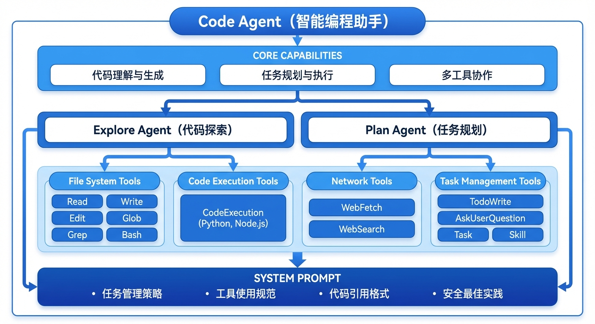
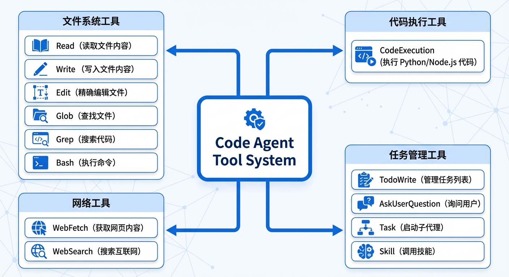
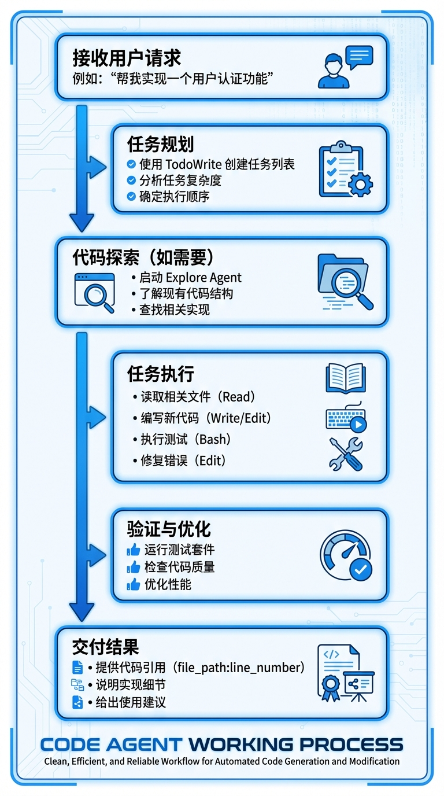
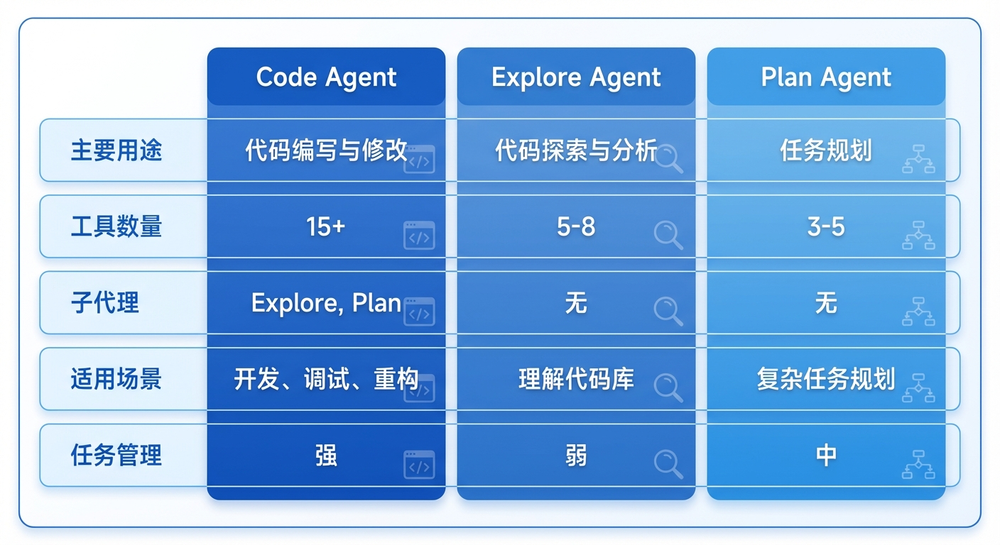

# Code Agent

Code Agent 是 AIME Chat 中最强大的智能编程助手，专门设计用于帮助开发者完成各种软件工程任务。它复现了 Claude Code 的核心功能，能够理解代码、编写代码、调试程序，并与您的开发环境深度集成。

## 概述

Code Agent 是一个全能型的编程助手，具备以下核心能力：

- 📝 **代码编写与修改** - 创建新文件、编辑现有代码、重构代码结构
- 🔍 **代码分析与理解** - 阅读代码库、解释代码逻辑、分析代码结构
- 🐛 **调试与修复** - 定位 bug、修复错误、运行测试
- 🏗️ **项目构建** - 执行构建命令、管理依赖、配置项目
- 📚 **文档生成** - 编写代码文档、生成 API 文档、创建 README
- 🔧 **工具调用** - 执行 shell 命令、运行脚本、管理 Git 仓库

## 架构设计

Code Agent 采用分层架构设计，通过丰富的工具集和子代理协作完成复杂任务：



## 核心特性

### 1. 智能任务管理

Code Agent 内置强大的任务管理系统，能够：

- **任务规划** - 将复杂任务分解为可执行的步骤
- **进度跟踪** - 实时显示任务完成状态
- **并行执行** - 同时执行多个独立任务
- **状态管理** - 维护任务状态（pending/in_progress/completed）

**示例**：

```
用户：帮我重构这个项目的代码结构

Agent：
1. [TodoWrite] 创建任务列表
   - 分析当前项目结构
   - 设计新的目录结构
   - 重构代码文件
   - 更新导入路径
   - 运行测试验证

2. [Explore] 探索代码库结构

3. [Plan] 制定重构计划

4. 逐步执行重构任务
```

### 2. 代码探索能力

通过 Explore 子代理，Code Agent 能够：

- 快速理解代码库结构
- 查找特定功能实现
- 分析代码依赖关系
- 识别代码模式

### 3. 任务规划能力

通过 Plan 子代理，Code Agent 能够：

- 制定详细的执行计划
- 评估任务复杂度
- 识别潜在风险
- 优化执行顺序

### 4. 丰富的工具集

Code Agent 配备了 15+ 个专业工具：



| 工具类别 | 工具 | 功能 |
|---------|------|------|
| **文件系统** | Read | 读取文件内容 |
| | Write | 写入文件内容 |
| | Edit | 精确编辑文件 |
| | Glob | 查找文件 |
| | Grep | 搜索代码 |
| | Bash | 执行命令 |
| **代码执行** | CodeExecution | 执行 Python/Node.js 代码 |
| **网络工具** | WebFetch | 获取网页内容 |
| | WebSearch | 搜索互联网 |
| **任务管理** | TodoWrite | 管理任务列表 |
| | AskUserQuestion | 询问用户 |
| | Task | 启动子代理 |
| | Skill | 调用技能 |

## 工作流程

Code Agent 的工作流程遵循以下步骤：



## 使用场景

### 场景 1：新功能开发

```
用户：帮我添加一个用户注册功能

Agent：
1. [TodoWrite] 创建任务列表
   - 分析现有认证系统
   - 设计注册 API
   - 实现注册逻辑
   - 添加输入验证
   - 编写单元测试

2. [Explore] 探索现有认证代码

3. [Read] 读取相关文件

4. [Write] 创建注册 API

5. [Edit] 更新路由配置

6. [Bash] 运行测试

7. 完成！注册功能已实现在 src/api/auth/register.ts:45
```

### 场景 2：Bug 修复

```
用户：修复登录功能的 bug

Agent：
1. [TodoWrite] 创建任务列表
   - 定位问题代码
   - 分析错误原因
   - 修复 bug
   - 验证修复

2. [Grep] 搜索登录相关代码

3. [Read] 读取登录逻辑

4. [Edit] 修复错误代码

5. [Bash] 运行测试验证

6. 完成！Bug 已修复在 src/api/auth/login.ts:78
```

### 场景 3：代码重构

```
用户：重构这个模块，提高代码可读性

Agent：
1. [TodoWrite] 创建任务列表
   - 分析当前代码结构
   - 识别重构点
   - 提取公共逻辑
   - 优化命名
   - 更新文档

2. [Explore] 探索模块结构

3. [Read] 读取所有相关文件

4. [Edit] 重构代码

5. [Write] 更新文档

6. [Bash] 运行测试

7. 完成！重构完成，代码可读性提升
```

### 场景 4：项目构建

```
用户：帮我构建这个项目

Agent：
1. [TodoWrite] 创建任务列表
   - 检查依赖
   - 安装缺失的包
   - 运行构建命令
   - 修复构建错误

2. [Bash] 检查 package.json

3. [Bash] 安装依赖

4. [Bash] 运行构建

5. [Edit] 修复构建错误

6. 完成！项目构建成功
```

## 系统提示设计

Code Agent 的系统提示包含以下关键部分：

### 1. 角色定义

```
You are a code agent that helps users with software engineering tasks.
Use the instructions below and the tools available to you to assist the user.
```

### 2. 语气与风格

- **简洁明了** - 响应简短，适合命令行界面
- **专业客观** - 优先考虑技术准确性
- **避免过度赞美** - 不使用不必要的赞美词汇
- **Markdown 格式** - 使用 GitHub 风格的 Markdown

### 3. 任务管理策略

- **频繁使用 TodoWrite** - 确保任务跟踪
- **及时更新状态** - 完成任务立即标记
- **避免批量完成** - 逐个标记任务完成

### 4. 工具使用规范

- **优先使用专用工具** - 文件操作使用 Read/Write/Edit
- **并行执行** - 独立任务并行处理
- **使用 Explore Agent** - 代码探索使用专用代理
- **安全第一** - 避免引入安全漏洞

### 5. 代码引用格式

```
When referencing specific functions or pieces of code include the pattern
`file_path:line_number` to allow the user to easily navigate to the source code location.

示例：
Clients are marked as failed in the `connectToServer` function in src/services/process.ts:712.
```

## 最佳实践

### 1. 明确任务描述

提供清晰、具体的任务描述：

```
✅ 好的描述：
"帮我实现一个用户注册功能，包括邮箱验证、密码加密和数据库存储"

❌ 不好的描述：
"帮我写个注册功能"
```

### 2. 提供上下文信息

提供相关的上下文信息：

```
✅ 好的上下文：
"项目使用 Express + TypeScript，数据库是 PostgreSQL，
现有认证系统在 src/auth/ 目录下"

❌ 缺少上下文：
"帮我实现注册功能"
```

### 3. 分阶段执行

对于复杂任务，分阶段执行：

```
阶段 1：分析现有代码
阶段 2：设计实现方案
阶段 3：编写代码
阶段 4：测试验证
```

### 4. 及时反馈

在执行过程中及时反馈进度：

```
"正在分析代码库..."
"已找到 3 个相关文件..."
"正在编写代码..."
"测试通过！"
```

## 安全机制

Code Agent 实现了多层安全保护：

### 1. 用户确认

危险操作需要用户确认：
- 文件删除
- 系统命令执行
- 网络请求

### 2. 权限控制

- 文件操作限制在指定目录
- 命令执行需要用户授权
- 网络请求有白名单机制

### 3. 沙箱隔离

代码执行在隔离环境中：
- Python 代码在独立进程运行
- Node.js 代码在沙箱中执行
- 资源使用受限

### 4. 审计日志

所有操作都有日志记录：
- 工具调用记录
- 文件操作记录
- 命令执行记录

## 性能优化

### 1. 并行执行

Code Agent 能够并行执行独立任务：

```
并行读取多个文件：
[Read] file1.ts
[Read] file2.ts
[Read] file3.ts
```

### 2. 缓存机制

- 文件内容缓存
- 搜索结果缓存
- 代码分析缓存

### 3. 智能工具选择

根据任务类型自动选择最佳工具：
- 文件搜索 → Glob/Grep
- 代码分析 → Explore Agent
- 任务规划 → Plan Agent

## 与其他 Agent 的区别



| 特性 | Code Agent | Explore Agent | Plan Agent |
|------|-----------|---------------|------------|
| **主要用途** | 代码编写与修改 | 代码探索与分析 | 任务规划 |
| **工具数量** | 15+ | 5-8 | 3-5 |
| **子代理** | Explore, Plan | 无 | 无 |
| **适用场景** | 开发、调试、重构 | 理解代码库 | 复杂任务规划 |
| **任务管理** | 强 | 弱 | 中 |

## 技术实现

### 代码结构

```typescript
export class CodeAgent extends BaseAgent {
  id: string = 'CodeAgent';
  name: string = 'Code Agent';
  description: string = 'A code agent that can help with code related tasks.';
  instructions: DynamicAgentInstructions = codeAgentInstructions;

  tools: string[] = [
    // 任务管理工具
    `${ToolType.BUILD_IN}:${TodoWrite.toolName}`,
    `${ToolType.BUILD_IN}:${AskUserQuestion.toolName}`,
    `${ToolType.BUILD_IN}:${Task.toolName}`,

    // 文件系统工具
    `${ToolType.BUILD_IN}:${Bash.toolName}`,
    `${ToolType.BUILD_IN}:${Read.toolName}`,
    `${ToolType.BUILD_IN}:${Write.toolName}`,
    `${ToolType.BUILD_IN}:${Edit.toolName}`,
    `${ToolType.BUILD_IN}:${Glob.toolName}`,
    `${ToolType.BUILD_IN}:${Grep.toolName}`,

    // 网络工具
    `${ToolType.BUILD_IN}:${WebFetch.toolName}`,
    `${ToolType.BUILD_IN}:${WebSearch.toolName}`,

    // 代码执行工具
    `${ToolType.BUILD_IN}:${CodeExecution.toolName}`,

    // 技能工具
    `${ToolType.BUILD_IN}:${Skill.toolName}`,
  ];

  subAgents: string[] = [
    `${Explore.agentName}`,
    `${Plan.agentName}`
  ];
}
```

### 动态指令

Code Agent 的指令是动态生成的，根据当前环境调整：

```typescript
export const codeAgentInstructions: DynamicAgentInstructions = ({
  requestContext,
  mastra,
}: {
  requestContext: RequestContext<ChatRequestContext>;
  mastra: Mastra;
}) => {
  // 获取工作目录信息
  const workspace = requestContext.get('workspace');
  const isGitRepo = fs.existsSync(path.join(workspace, '.git'));

  // 获取可用工具
  const tools = requestContext.get('tools') ?? [];
  const hasTaskTool = tools.includes(`${ToolType.BUILD_IN}:${Task.toolName}`);

  // 生成动态指令
  return {
    role: 'system',
    content: `...包含环境信息和工具配置的指令...`,
  };
};
```

## 常见问题

### Q1: Code Agent 能处理多大的代码库？

A: Code Agent 可以处理大型代码库，但建议：
- 对于超大型项目，先使用 Explore Agent 探索
- 分模块处理，避免一次性加载过多文件
- 使用 Glob/Grep 精确定位相关代码

### Q2: Code Agent 会修改我的代码吗？

A: Code Agent 只会在以下情况下修改代码：
- 您明确要求修改
- 修复 bug 时
- 重构代码时

所有修改都会提供代码引用，方便您审查。

### Q3: 如何确保 Code Agent 的代码质量？

A: Code Agent 遵循以下原则：
- 遵循项目现有代码风格
- 添加必要的注释
- 运行测试验证
- 避免引入安全漏洞

### Q4: Code Agent 支持哪些编程语言？

A: Code Agent 支持所有主流编程语言：
- JavaScript/TypeScript
- Python
- Java
- Go
- Rust
- C/C++
- 等等

### Q5: Code Agent 能处理 Git 操作吗？

A: 是的，Code Agent 可以：
- 执行 Git 命令
- 创建提交
- 管理分支
- 处理合并冲突

## 总结

Code Agent 是 AIME Chat 中最强大的编程助手，它：

✅ **功能全面** - 涵盖代码编写的各个方面
✅ **智能高效** - 自动规划任务，优化执行流程
✅ **安全可靠** - 多层安全保护，确保代码安全
✅ **易于使用** - 自然语言交互，无需学习复杂命令
✅ **持续进化** - 基于最新的 AI 技术，不断改进

无论您是初学者还是经验丰富的开发者，Code Agent 都能成为您的得力助手，让编程变得更加高效和愉快！

## 相关文档

- [Agent 概览](./overview.md)
- [工具系统](../features/tools.md)
- [Explore Agent](./explore-agent.md)
- [Plan Agent](./plan-agent.md)
