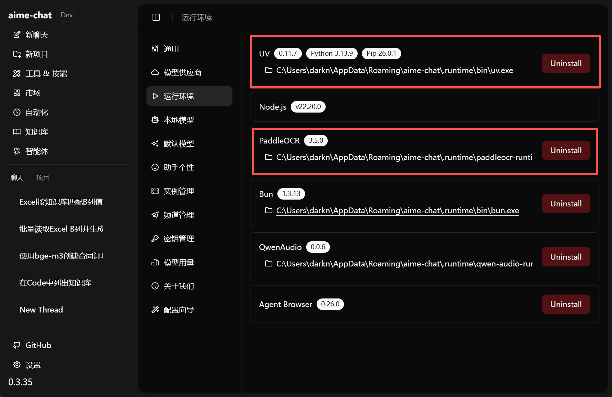
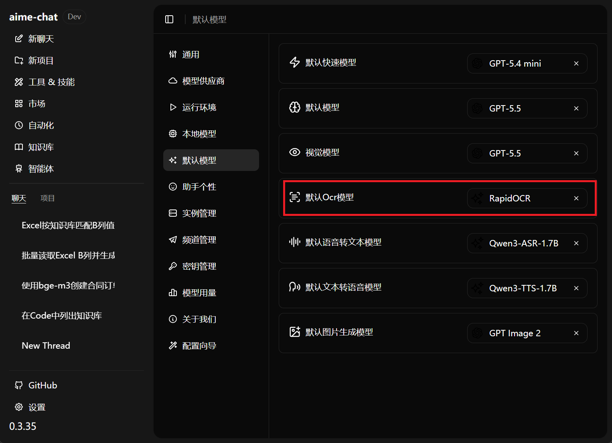
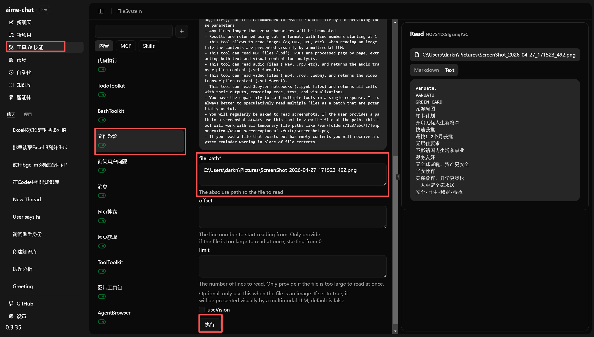
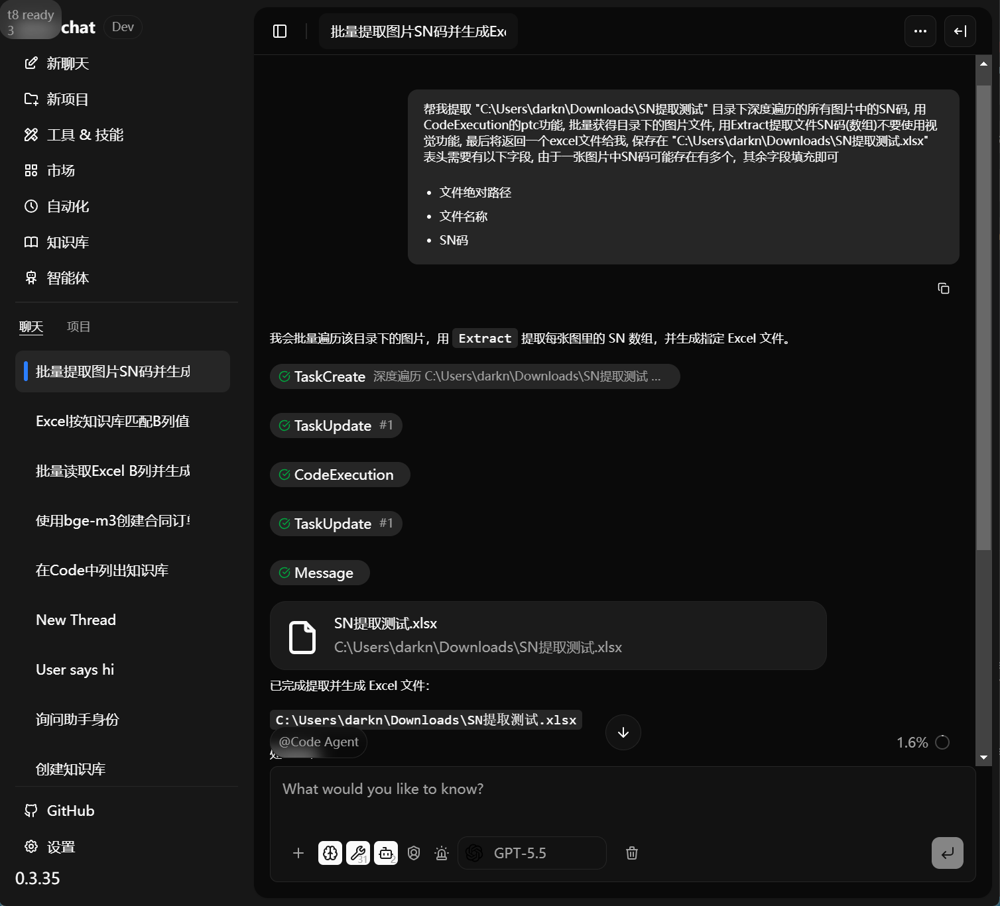
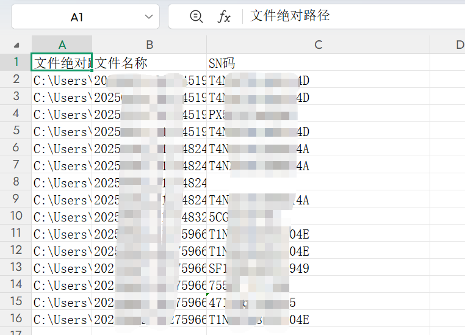

# 案例：批量提取目录中所有图片的 SN 码

## 背景介绍

在设备巡检、入库登记或包装核对等场景中，经常需要从图片中识别文字，并提取设备或包装盒上的 SN 码作为检查依据。本案例将演示如何批量遍历指定目录中的图片，识别并汇总其中的 SN 码，最终生成 Excel 结果文件。

## 环境准备

打开 **设置 - 运行环境**，确认已完整安装 `uv` 和 `PaddleOCR` 运行环境。



打开 **设置 - 默认模型 - 默认 OCR 模型**，选择 **RapidOCR**。



## 测试 OCR 功能是否正常

进入 **工具 & 技能 - 文件系统 - 文件读取**，将需要进行 OCR 识别的文件路径复制到 `file_path` 中，然后点击 **执行**。如果能够返回正确的识别结果，说明 OCR 功能工作正常。



## 开始批量识别并提取

本案例需要使用两个工具和一个大模型。开始前，请确认模型 API 可以正常调用：

- **文件提取 Extract**
- **代码执行 CodeExecution**

> 如果文件内容涉及保密信息，建议使用本地部署的开源模型。可以在 **Extract** 配置中选择其他模型；如果不额外配置，则会默认使用当前对话中的主模型。

> 如果需要同时输出 OCR 原文内容，可以在提示词中明确要求使用 **Read** 工具。

在聊天框中选择 **Extract** 工具，并输入提示词。由于不同模型的能力存在差异，建议把目录路径、遍历方式、提取字段、输出格式和保存路径说明清楚，以便模型稳定执行。

```text
帮我提取 "C:\Users\noah\Downloads\SN提取测试" 目录下所有图片中的 SN 码。

要求：
1. 使用 CodeExecution 的 PTC 功能，递归遍历该目录，批量获取所有图片文件。
2. 使用 Extract 提取每张图片中的 SN 码，结果以数组形式返回。
3. 不要使用视觉功能。
4. 最后生成一个 Excel 文件，并保存到 "C:\Users\noah\Downloads\SN提取测试.xlsx"。

Excel 表头需要包含以下字段。由于一张图片中可能存在多个 SN 码，其余字段按实际结果填充即可：
- 文件绝对路径
- 文件名称
- SN 码
```



执行完成后，可以得到结果表 `SN提取测试.xlsx`。


