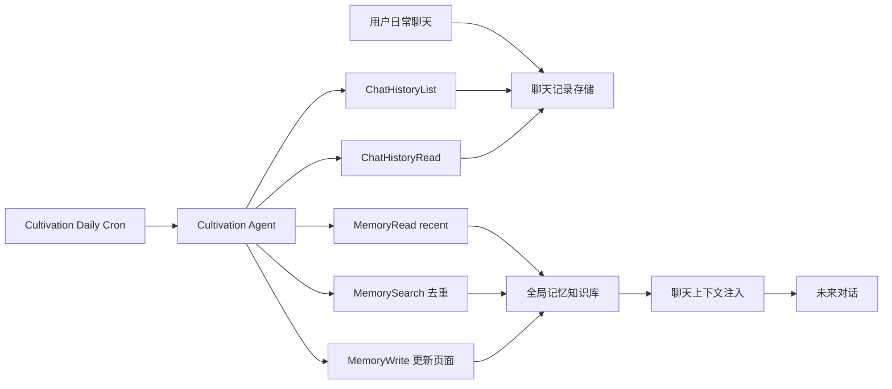
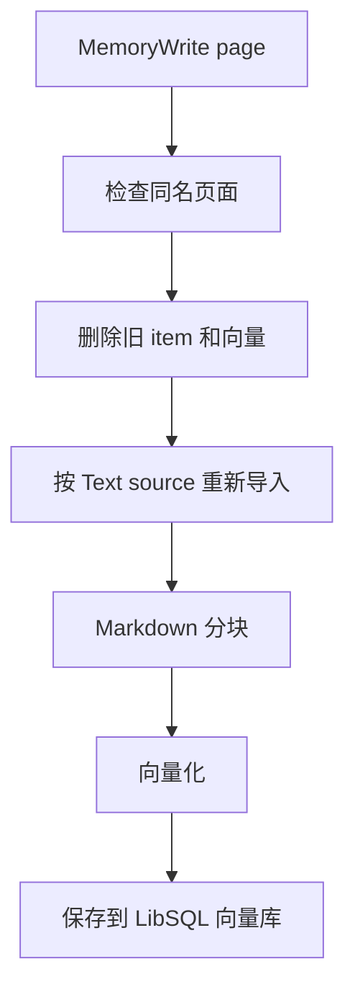
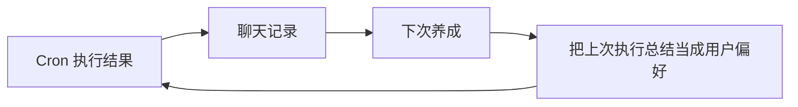
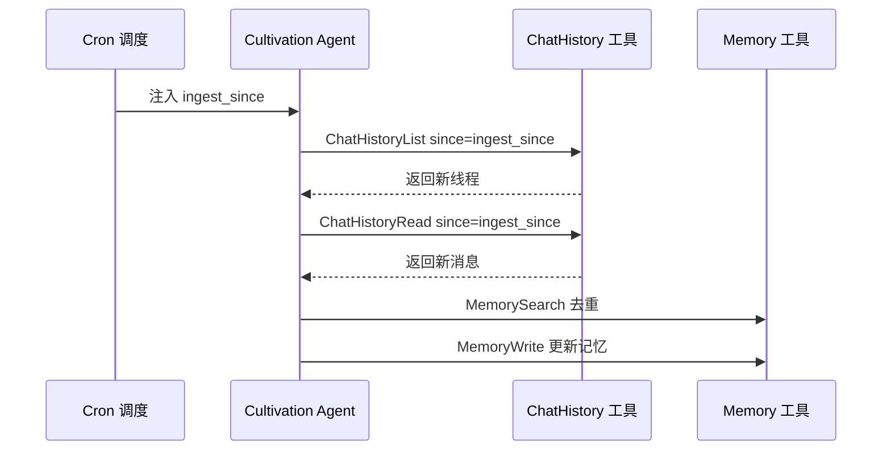
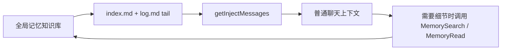

# 养成记忆

养成记忆是 AIME Chat 中用于长期积累用户偏好、习惯、项目上下文和重要事实的全局记忆模块。它不是把每次对话都简单拼进上下文，而是由专门的 **Cultivation Agent** 定期读取聊天记录，提取值得长期保存的信息，并维护一套结构化的 Markdown Wiki。

这个模块适合用来沉淀：

- 用户偏好，例如沟通语言、输出格式、代码风格
- 用户习惯，例如常用工作流、固定检查步骤、重复任务
- 项目上下文，例如正在推进的项目、关键决策、未解决问题
- 人物和实体，例如用户提到的重要联系人、组织、工具
- 长期事实，例如反复出现并且未来可能继续有用的信息

## 核心概念

养成记忆由三个部分组成：

| 模块 | 作用 |
|------|------|
| 全局记忆知识库 | 一个 `static=true` 的系统知识库，用来保存长期记忆 Wiki |
| Memory 工具集 | 让 Agent 读取、写入、搜索、删除和列出记忆页面 |
| Cultivation Agent | 定时读取聊天记录，将新信息整理进全局记忆 |
| 自动化 Cron | 定期触发 Cultivation Agent，让记忆持续更新 |

全局记忆知识库中包含两个系统页面：

| 页面 | 说明 |
|------|------|
| `index.md` | 记忆 Wiki 的目录，列出已有页面和简短摘要 |
| `log.md` | 追加式时间线，记录每次养成处理了哪些聊天记录、更新了哪些页面 |

除这两个系统页面外，其余页面都是主题页，例如：

```text
preferences.md
habits.md
people/noah.md
projects/aime-chat.md
2026-04-28.md
```

## 工作流程

养成记忆的运行流程如下：



一次自动养成大致会做这些事情：

1. 读取 `index.md` 和 `log.md`，了解当前记忆结构和最近处理记录。
2. 读取上次养成之后更新过的聊天线程。
3. 过滤掉由 Cron 自己创建的聊天线程，避免把自己的执行结果再次摄入。
4. 从真实用户聊天中抽取偏好、习惯、项目、人物、决策和待办。
5. 使用 `MemorySearch` 检查是否已经存在相似记忆，避免重复写入。
6. 更新或创建主题页面。
7. 刷新 `index.md`。
8. 向 `log.md` 追加一条记录，写明本次摄入了哪些 thread，以及更新了哪些页面。

## 与普通知识库的区别

普通知识库更像是文档检索系统：你导入文件，聊天时检索相关片段。

养成记忆更像一个由 AI 维护的个人 Wiki：

| 对比项 | 普通知识库 | 养成记忆 |
|--------|------------|----------|
| 数据来源 | 用户手动导入文档 | 用户聊天记录、笔记和长期上下文 |
| 更新方式 | 手动添加或删除 | Cultivation Agent 定期整理 |
| 结构 | 文档和分块 | `index.md`、`log.md`、主题页 |
| 目标 | 回答基于文档的问题 | 累积用户偏好、习惯和上下文 |
| 注入方式 | 聊天时按问题检索 | 每次聊天注入记忆摘要，必要时再检索 |

## 自动创建的全局记忆知识库

系统会尝试自动创建一个固定 ID 的全局记忆知识库：

```text
static_memory
```

这个知识库在界面中会显示为全局记忆，且不可删除。它仍然出现在当前知识库列表中，而不是放在侧边栏的额外入口里。

:::tip 提示
全局记忆知识库依赖向量模型。如果应用还没有可用的 embedding 模型，系统会跳过自动创建，并在后续启动时再次尝试。
:::

## Memory 工具集

Cultivation Agent 通过 Memory 工具集操作全局记忆。

| 工具 | 作用 |
|------|------|
| `MemoryRead` | 读取 `index.md`、`log.md`、某个主题页，或读取最近记忆摘要 |
| `MemoryWrite` | 写入 `index.md`、`log.md`、主题页或每日笔记 |
| `MemorySearch` | 在全局记忆中做语义搜索，用来去重和查找相关页面 |
| `MemoryDelete` | 删除普通主题页，不能删除 `index.md` 和 `log.md` |
| `MemoryList` | 列出所有普通主题页 |

写入主题页时，系统会重新走知识库的导入流程：



这样可以保证每次记忆页面更新后，语义检索结果也是最新的。

## ChatHistory 工具集

为了让养成模块真正读取聊天记录，Cultivation Agent 还会使用 ChatHistory 工具集。

| 工具 | 作用 |
|------|------|
| `ChatHistoryList` | 列出最近更新过的聊天线程，默认过滤 Cron 自己创建的线程 |
| `ChatHistoryRead` | 读取指定线程的消息内容，支持按时间过滤 |
| `ChatHistorySearch` | 跨聊天线程做关键词搜索，默认只搜索真实用户线程 |

自动养成时，系统会给 Agent 注入一个 Cron 上下文，其中包含：

```text
<cron-context>
cron_id: builtin_cultivation_daily
cron_name: Cultivation Daily
started_at: 2026-04-28T15:00:00.000Z
previous_run_at: 2026-04-27T15:00:00.000Z
ingest_since: 2026-04-27T15:00:00.000Z
</cron-context>
```

Agent 会把 `ingest_since` 作为 `ChatHistoryList` 和 `ChatHistoryRead` 的时间过滤条件，只处理上次执行之后的新内容。

## 防止重复养成

养成模块有多层防重复机制。

### 1. 过滤 Cron 自己创建的聊天记录

Cron 触发执行时，会创建一条新的聊天线程。系统会给这类线程打上元数据标记：

```text
metadata.cron = true
metadata.cronId = <cron id>
```

`ChatHistoryList` 和 `ChatHistorySearch` 默认会跳过这些线程，`ChatHistoryRead` 默认也会拒绝读取 Cron 线程。

这可以避免如下循环：



实际机制会在 `ChatHistory*` 工具层截断这个循环。

### 2. 使用 `ingest_since` 做增量读取

每次 Cron 执行时，系统会记录上一次执行时间，并注入 `ingest_since`。



这样即使同一条聊天线程跨多天持续更新，Agent 也只读取上次养成之后新增的消息。

### 3. 在 `log.md` 中记录已处理 thread

每次养成结束后，Agent 会向 `log.md` 写入类似记录：

```text
## [2026-04-28 23:00]

ingested threads: abc123, def456
updated pages: preferences.md, projects/aime-chat.md
```

下次执行时，Agent 会先读取 `log.md` 尾部，跳过最近已经处理过的 thread。

### 4. 同一任务防并发执行

Cron Manager 会记录正在运行的任务。如果同一个 Cron 上一次还没结束，下一次触发会被跳过，避免并发写入同一批记忆。

```text
previous run still in progress → skip
```

## 默认定时任务

系统会自动创建一条内置任务：

```text
Cultivation Daily
```

默认配置：

| 配置 | 默认值 |
|------|--------|
| Cron | `0 23 * * *` |
| Agent | `Cultivation` |
| 状态 | 默认关闭 |
| 作用 | 每天读取新增聊天记录，更新全局记忆 Wiki |

:::tip 提示
默认任务是关闭的。进入自动化页面后，打开 `Cultivation Daily` 的启用开关，才会开始自动养成。
:::

## 如何开启自动养成

1. 确保已经配置可用的向量模型。
2. 打开 **知识库** 页面，确认存在 **全局记忆** 知识库。
3. 打开 **自动化 / Crons** 页面。
4. 找到 `Cultivation Daily`。
5. 打开启用开关。
6. 如需调整频率，编辑任务中的 Cron 表达式。

常见频率示例：

```text
0 23 * * *
```

每天 23:00 执行。

```text
0 */6 * * *
```

每 6 小时执行一次。

```text
30 9 * * 1
```

每周一 09:30 执行。

## 手动创建新的养成任务

除了默认的 `Cultivation Daily`，你也可以创建更细分的养成任务。

例如只整理用户偏好：

```text
读取 ingest_since 之后的聊天记录，只抽取用户偏好、输出格式要求、代码风格偏好。
更新 preferences.md，并在 log.md 中记录摄入的 thread id。
不要处理项目状态和临时待办。
```

例如只整理项目上下文：

```text
读取 ingest_since 之后的聊天记录，只整理项目相关事实、架构决策、待解决问题。
优先更新 projects/<project-name>.md。
刷新 index.md，并在 log.md 中记录摄入的 thread id。
```

创建时建议：

- Agent 选择 `Cultivation`
- Prompt 明确本次只处理哪一类信息
- 频率先设置为每天一次或每周一次
- 观察 `log.md` 和对应主题页是否符合预期后，再提高频率

## 上下文注入

全局记忆不是每次都把所有页面塞进模型上下文。为了控制成本和噪声，系统默认只注入一个摘要：

- `index.md` 全文
- `log.md` 最近若干行

注入位置在聊天开始前，作为系统提醒进入上下文。模型可以先看到记忆目录和最近更新记录；如果需要更具体的信息，再通过 `MemorySearch` 或 `MemoryRead` 读取对应页面。



## 推荐实践

### 1. 从默认 Daily 任务开始

第一次使用时，建议只打开默认 `Cultivation Daily`，观察几天的 `log.md` 和 `preferences.md`、`habits.md` 是否符合预期。

### 2. 不要一开始就高频执行

养成任务会读取聊天记录并写入知识库。过高频率可能造成重复整理或噪声增加。建议从每天一次开始。

### 3. 让主题页保持短而清晰

每个主题页应尽量保持结构化：

```text
# Preferences

## Communication
- Always respond in Chinese.

## Coding
- Prefer concise implementation summaries.
```

### 4. 用 `log.md` 审计更新

如果发现记忆写错了，先看 `log.md` 找到是哪次执行引入的，再去对应主题页修改。

### 5. 重要事实要可回溯

建议在主题页里保留简短来源说明，例如 thread id 或日期，方便之后排查。

## 常见问题

### 养成模块会自动学习所有聊天内容吗？

不会。它只会在启用 `Cultivation Daily` 或其他养成 Cron 后，按照 prompt 和工具规则读取聊天记录。并且默认只处理上次执行后的新内容。

### 会不会把 Cron 自己的执行结果也学习进去？

不会。Cron 创建的线程会带有 `metadata.cron = true`，ChatHistory 工具默认过滤这类线程。

### 会不会重复写入同一条偏好？

系统通过 `ingest_since`、`log.md` thread id 记录和 `MemorySearch` 语义去重来降低重复概率。对于表达相近但不完全相同的偏好，Agent 会优先更新已有页面，而不是创建新页面。

### 我可以手动编辑记忆吗？

可以。全局记忆知识库显示在知识库列表中。`index.md` 和 `log.md` 不能删除，但可以查看和编辑。普通主题页可以查看、编辑和删除。

### 如果记忆写错了怎么办？

进入知识库中的全局记忆，找到对应主题页直接修改即可。修改后页面会重新向量化，后续检索会使用新的内容。

## 下一步

建议按以下顺序使用：

1. 配置向量模型。
2. 确认全局记忆知识库已创建。
3. 启用默认 `Cultivation Daily`。
4. 第二天检查 `log.md`、`preferences.md` 和 `habits.md`。
5. 根据结果调整 Cron Prompt 或执行频率。
