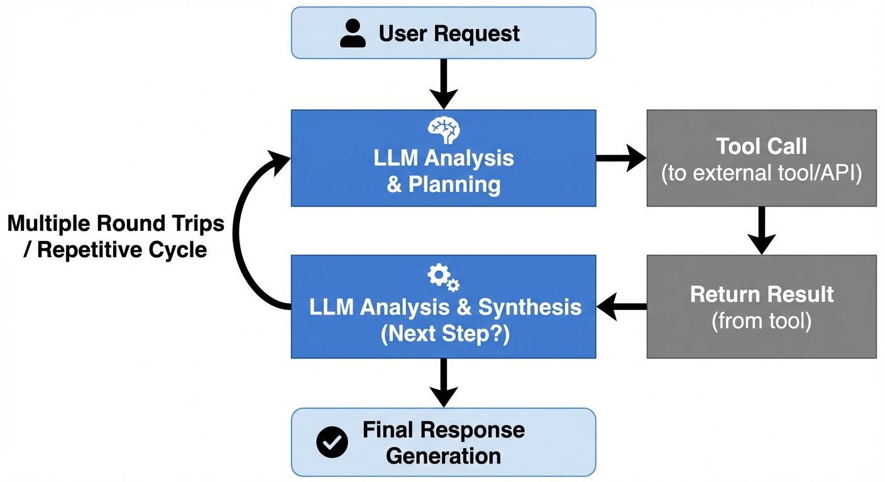
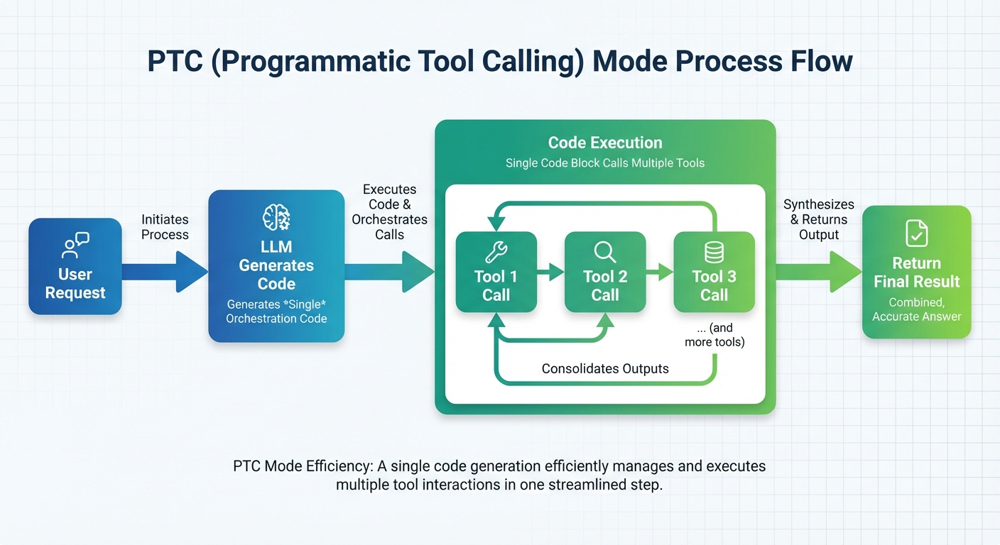
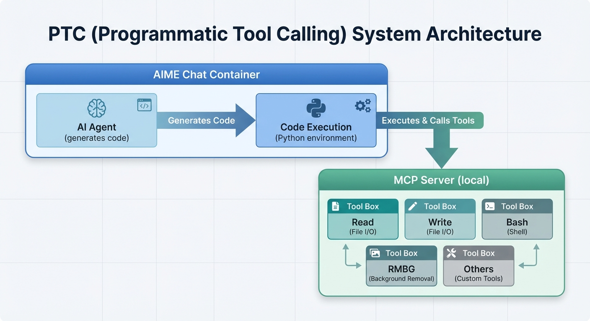
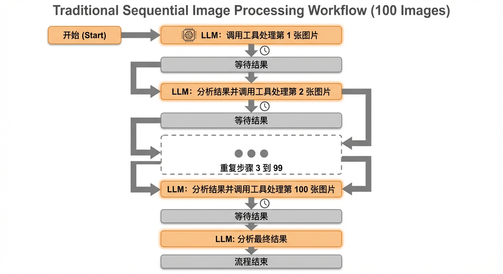
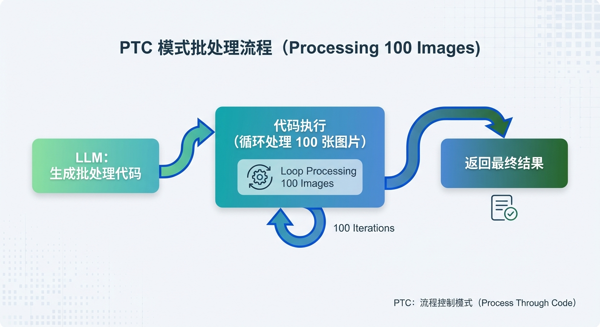

# PTC 模式（程序化工具调用）

AIME Chat 支持 **PTC（Programmatic Tool Calling）** 模式，允许 AI 在代码执行环境中以编程方式调用工具，而不需要每次工具调用都通过模型进行往返。

## 什么是 PTC 模式？

传统的工具调用方式中，每次调用工具都需要：



这种方式存在以下问题：

- **上下文污染**：每次工具调用的结果都会返回到 LLM 的上下文中，占用大量 Token
- **推理开销**：每次工具调用都需要模型进行一次完整推理
- **延迟累积**：多个工具调用需要多次往返，延迟不断累积

PTC 模式通过让 LLM 生成代码来编排工具调用，一次性执行多个工具操作：



### PTC 架构



## PTC 模式的优势

| 优势 | 说明 |
|------|------|
| **减少上下文污染** | 中间结果不返回给 LLM，仅返回最终结果 |
| **降低推理开销** | 一次代码生成，执行多个工具调用 |
| **提高执行效率** | 减少 LLM 往返次数，降低延迟 |
| **增强灵活性** | 可以使用循环、条件判断等编程逻辑 |
| **更好的错误处理** | 代码中可以实现 try-catch 等错误处理 |

## 工作原理

当启用 PTC 模式时，AIME Chat 会：

1. **启动本地 MCP 服务器**：在本地端口上启动 MCP 服务器
2. **注入工具函数**：通过 `sitecustomize.py` 将所有可用工具注入到 Python 的 `builtins` 中
3. **执行代码**：在隔离的 Python 环境中执行生成的代码
4. **工具调用**：代码中的工具调用通过 MCP 协议发送到本地服务器
5. **返回结果**：将代码执行的最终输出返回给 LLM

### 技术实现

PTC 模式使用 [MCP（Model Context Protocol）](https://modelcontextprotocol.io/) 协议实现工具调用：

```python
# 工具函数通过 MCP 协议调用
async with streamablehttp_client(MCP_SERVER_URL) as (read_stream, write_stream, _):
    async with ClientSession(read_stream, write_stream) as session:
        await session.initialize()
        result = await session.call_tool(name, kwargs)
```

所有工具被自动注入到 Python 环境中，可以直接使用：

```python
# 无需 import，直接使用工具
result = await Read(file_path="/path/to/file.txt")
```

## 使用方法

### 基本用法

在使用 Code Execution（Python）工具时，PTC 模式默认启用。工具调用示例：

```python
import asyncio

async def main():
    # 直接调用已有工具
    content = await Read(file_path="/path/to/file.txt")
    print(content)

asyncio.run(main())
```

### 参数说明

| 参数 | 类型 | 默认值 | 说明 |
|------|------|--------|------|
| `code` | string | 必需 | 要执行的 Python 代码 |
| `packages` | string[] | [] | 需要安装的 Python 包 |
| `ptc` | boolean | true | 是否启用 PTC 模式 |

### 工具调用规则

:::tip 使用提示
1. **所有工具都是异步的**：必须使用 `await` 调用
2. **无需导入**：工具函数已全局注入，可直接使用
3. **返回值为文本**：所有工具返回字符串类型
4. **JSON 解析**：如果返回值是 JSON，请使用 `json.loads()` 解析
:::

## 实际示例

### 示例 1：批量处理图片背景

假设有一个 `RemoveBackground` 工具用于移除图片背景：

```python
import asyncio
import glob
import os
import json

async def main():
    # 查找所有 jpg 图片
    images = glob.glob('/path/to/images/**/*.jpg', recursive=True)
    
    for image_path in images:
        # 生成输出路径
        output_path = "/path/to/output/" + os.path.basename(image_path).replace('.jpg', '_nobg.png')
        
        # 调用移除背景工具
        result_text = await RemoveBackground(
            url_or_file_path=image_path,
            save_path=output_path
        )
        
        # 解析 JSON 结果
        result = json.loads(result_text)
        print(f"Processed: {image_path} -> {result}")
    
    print('All images processed!')

asyncio.run(main())
```

### 示例 2：分析员工费用数据

结合费用管理工具集进行数据分析：

```python
import asyncio
import json

async def main():
    # 获取工程部门的团队成员
    members_text = await get_team_members(department="engineering")
    members = json.loads(members_text)
    
    total_expenses = 0
    
    for member in members:
        # 获取每个成员的 Q1 费用
        expenses_text = await get_expenses(
            employee_id=member['id'],
            quarter="Q1"
        )
        expenses = json.loads(expenses_text)
        
        # 计算该成员的总费用
        member_total = sum(e['amount'] for e in expenses if e['status'] == 'approved')
        total_expenses += member_total
        
        print(f"{member['name']}: ${member_total:.2f}")
    
    print(f"\nEngineering Q1 Total: ${total_expenses:.2f}")

asyncio.run(main())
```

### 示例 3：文件批量处理

```python
import asyncio
import json

async def main():
    # 使用 Glob 查找所有 TypeScript 文件
    files_text = await Glob(pattern="**/*.ts", path="/path/to/project/src")
    files = json.loads(files_text)
    
    for file_path in files[:10]:  # 只处理前 10 个
        # 读取文件内容
        content = await Read(file_path=file_path)
        
        # 统计行数
        lines = content.count('\n') + 1
        print(f"{file_path}: {lines} lines")

asyncio.run(main())
```

### 示例 4：Web 数据采集与处理

```python
import asyncio
import json

async def main():
    # 搜索相关信息
    search_result = await WebSearch(query="Python 3.12 new features")
    
    # 获取网页内容
    page_content = await WebFetch(
        url="https://docs.python.org/3.12/whatsnew/3.12.html",
        prompt="提取 Python 3.12 的主要新特性列表"
    )
    
    # 保存结果
    await Write(
        file_path="/path/to/python312-features.md",
        content=page_content
    )
    
    print("Done!")

asyncio.run(main())
```

## 可用工具

在 PTC 模式中，所有当前上下文中启用的工具都可以使用。常见工具包括：

### 文件操作

| 工具 | 说明 | 参数 |
|------|------|------|
| `Read` | 读取文件内容 | `file_path` |
| `Write` | 写入文件 | `file_path`, `content` |
| `Edit` | 编辑文件 | `file_path`, `old_string`, `new_string` |
| `Glob` | 文件搜索 | `pattern`, `path` |
| `Grep` | 内容搜索 | `pattern`, `path` |

### 代码执行

| 工具 | 说明 | 参数 |
|------|------|------|
| `Bash` | 执行 Shell 命令 | `command`, `directory` |

### 网络工具

| 工具 | 说明 | 参数 |
|------|------|------|
| `WebSearch` | 搜索互联网 | `query` |
| `WebFetch` | 获取网页内容 | `url`, `prompt` |

### 图像处理

| 工具 | 说明 | 参数 |
|------|------|------|
| `RemoveBackground` | 移除图片背景 | `url_or_file_path`, `save_path` |
| `Vision` | 分析图片内容 | `file_path` |

:::info 工具可用性
可用的工具取决于当前 Agent 配置和会话设置。使用前请确认工具已启用。
:::

## 与传统工具调用的对比

### 场景：处理 100 张图片

**传统方式**：



- **LLM 推理次数**：100+ 次
- **往返延迟**：累计非常高
- **Token 消耗**：每次都要包含历史结果

**PTC 模式**：



- **LLM 推理次数**：1-2 次
- **往返延迟**：最小化
- **Token 消耗**：仅需最终结果

### 性能对比

| 指标 | 传统方式 | PTC 模式 | 提升 |
|------|----------|----------|------|
| 100 个工具调用的 LLM 推理次数 | 100+ 次 | 1-2 次 | 50x+ |
| Token 消耗 | 高 | 低 | 5-10x |
| 总延迟 | 高 | 低 | 显著降低 |
| 复杂逻辑支持 | 有限 | 完整 | - |

## 最佳实践

### 1. 合理使用 PTC 模式

✅ **适合 PTC 的场景**：
- 批量文件处理
- 数据聚合和分析
- 需要循环或条件逻辑
- 多步骤工作流

❌ **不适合 PTC 的场景**：
- 简单的单次工具调用
- 需要人工确认的操作
- 交互式的工具使用

### 2. 代码编写建议

```python
import asyncio
import json

async def main():
    try:
        # 1. 使用 try-catch 处理错误
        result = await SomeTool(param="value")
        
        # 2. 正确解析 JSON 返回值
        data = json.loads(result)
        
        # 3. 使用 print 输出需要返回的信息
        print(f"处理完成: {len(data)} 条记录")
        
    except Exception as e:
        print(f"Error: {e}")

asyncio.run(main())
```

### 3. 性能优化

```python
import asyncio

async def main():
    # 并行执行多个独立的工具调用
    tasks = [
        Read(file_path="/path/to/file1.txt"),
        Read(file_path="/path/to/file2.txt"),
        Read(file_path="/path/to/file3.txt"),
    ]
    results = await asyncio.gather(*tasks)
    
    for i, content in enumerate(results):
        print(f"File {i+1}: {len(content)} chars")

asyncio.run(main())
```

## 常见问题

### PTC必要配置

> 需要到 设置-通用-API服务 启动服务端口, 当显示 **服务端口正在运行中** 的提示即可正常使用

### PTC 模式下工具调用失败

**可能原因**：
1. 工具未在当前上下文中启用
2. MCP 服务器未正常运行
3. 工具参数错误

**解决方案**：
1. 检查 Agent 配置中是否启用了该工具
2. 确认 AIME Chat 的 API 服务器正在运行
3. 查看代码执行日志获取详细错误信息

### 如何知道有哪些工具可用？

在 PTC 模式下，所有当前会话中可用的工具都会被自动注入。你可以：

1. 查看 Agent 配置中启用的工具列表
2. 查看聊天界面中显示的可用工具

### 返回值如何处理？

所有工具返回值都是字符串类型。如果工具返回 JSON 格式的数据，需要使用 `json.loads()` 解析：

```python
import json

result_text = await get_team_members(department="engineering")
members = json.loads(result_text)  # 转换为 Python 对象

for member in members:
    print(member['name'])
```

### 代码执行超时怎么办？

每次代码执行都有时间限制。对于长时间运行的任务，建议：

1. 分批处理数据
2. 添加进度输出
3. 使用增量处理策略

## 技术细节

### 工具注入机制

PTC 模式通过 Python 的 `sitecustomize.py` 机制实现工具注入：

```python
import builtins

def _init_mcp_tools():
    tool_names = asyncio.run(_list_tools_async())
    for name in tool_names:
        setattr(builtins, name, _make_async_tool_func(name))

_init_mcp_tools()
```

### MCP 协议

PTC 使用 [MCP（Model Context Protocol）](https://modelcontextprotocol.io/) 作为工具调用协议：

- **传输方式**：Streamable HTTP
- **服务地址**：`http://localhost:{port}/mcp`
- **会话管理**：每次代码执行创建独立会话

### 执行环境

- **Python 版本**：3.10+
- **运行时**：UV（高性能 Python 包管理器）
- **隔离性**：每次执行在独立的临时目录中
- **依赖管理**：通过 `packages` 参数安装依赖

```typescript
interface CodeExecutionInput {
  code: string;           // Python 代码
  packages?: string[];    // 依赖包列表
  ptc?: boolean;          // 是否启用 PTC（默认 true）
}
```

## 相关资源

- [工具系统文档](./tools.md)
- [Agent 管理文档](./agents.md)
- [MCP 协议官方文档](https://modelcontextprotocol.io/)
- [Mastra 框架文档](https://mastra.ai/docs)

