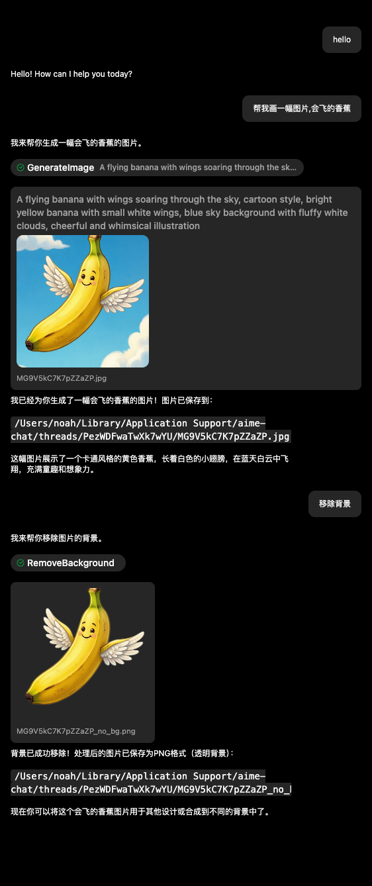

# RemoveBackground 背景移除

RemoveBackground 使用本地模型生成主体 Alpha Mask，并保存为带透明通道的 PNG。



## 前置要求

1. 进入 **设置 → 本地模型**
2. 下载 `ben2`、`rmbg-1.4` 或 `rmbg-2.0` 中至少一个背景移除模型
3. 在工具或 Agent 配置中启用 Image Toolkit / RemoveBackground
4. 如需固定模型，在 RemoveBackground 配置中选择 `modelName`

未明确指定模型时，应用会按 `ben2` → `rmbg-1.4` → `rmbg-2.0` 的顺序使用第一个已安装模型。

## 参数

| 参数 | 类型 | 必需 | 说明 |
|------|------|------|------|
| `file_path_or_url` | string | 是 | 本地图片路径或 HTTP(S) URL |
| `save_path` | string | 否 | 输出 PNG 路径；省略时在当前工作区生成随机文件名 |

参数名必须是 `file_path_or_url`。旧版文档中的 `url_or_file_path` 不会通过当前 schema 校验。

## 示例

### 本地图片

```json
{
  "file_path_or_url": "/Users/username/Pictures/product.jpg",
  "save_path": "/Users/username/Pictures/product-no-bg.png"
}
```

### 网络图片并自动命名

```json
{
  "file_path_or_url": "https://example.com/product.png"
}
```

URL 输入会先下载到本地临时文件。输出始终编码为 PNG，并使用输入图片的宽高。

## 批量处理

批量任务可以先用 Glob 获取文件，再逐个调用 RemoveBackground；启用 PTC 的 CodeExecution 也可以在代码中编排多次工具调用。

批量处理前建议：

- 使用独立输出目录，避免覆盖原图
- 先抽样比较不同模型的边缘效果
- 控制并发，避免同时加载过多高分辨率图片
- 保留失败文件列表，便于人工复核

## 常见问题

### No background removal model available

应用没有找到已安装或已配置的模型。回到 **设置 → 本地模型** 检查下载状态，并确认 Agent 的 RemoveBackground 配置没有指向未安装模型。

### 本地路径读取失败

确认路径指向普通文件，并且 AIME Chat 当前操作系统用户有读取权限。相对输出路径会按当前工作区解析；不确定时使用绝对路径。

### 网络图片失败

确认 URL 可直接返回图片，而不是需要登录或跳转的网页。代理、证书或来源站防盗链也可能阻止下载。

### 边缘质量不理想

不同模型对人像、商品和复杂背景表现不同。可以切换 `ben2`、`rmbg-1.4` 或 `rmbg-2.0` 比较，并尽量使用主体清晰、分辨率适中的原图。

## 隐私说明

模型推理在本地进行。本地文件不会因为移除背景而自动上传；如果输入是网络 URL，应用仍需要联网下载原图。
