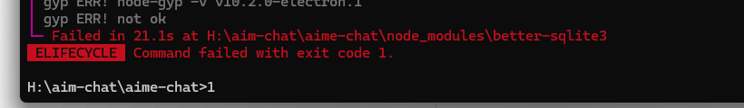
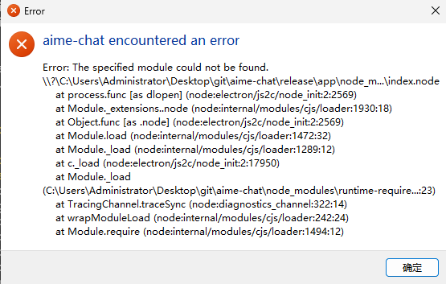

# 常见问题

本页整理了安装和开发过程中常见的问题及解决方法。

## 依赖初始化失败

- 原因: 需要更换国内源pnpm源

> 如果在执行依赖安装或项目初始化时出现下载失败、原生模块编译失败、Electron 相关依赖拉取失败等问题，通常可以通过修改用户目录下的 `~/.npmrc` 解决。

### 配置文件位置

- **macOS**：`~/.npmrc`
- **Windows**：`C:\Users\你的用户名\.npmrc`

如果文件不存在，可以手动创建。

### 添加以下配置

将下面内容添加到 `~/.npmrc`：

```ini
better_sqlite3_binary_host_mirror=https://registry.npmmirror.com/-/binary/better-sqlite3
canvas_binary_host_mirror=https://registry.npmmirror.com/-/binary/canvas
electron_builder_binaries_mirror=https://registry.npmmirror.com/-/binary/electron-builder-binaries/
electron_mirror=https://registry.npmmirror.com/-/binary/electron/
python_mirror=https://registry.npmmirror.com/-/binary/python/
registry=https://registry.npmmirror.com/
sqlite3_binary_host_mirror=https://registry.npmmirror.com/
strict-ssl=false
```

### 保存后重新安装

保存配置后，重新执行依赖安装命令，例如：

```bash
pnpm install
```

如果之前已经安装失败过，也可以先清理后再重试。

## 端口占用

如果启动时提示端口被占用：

```bash
# 终止占用端口的进程
pnpm kill-port
```


## 运行失败或启动调试失败

- 原因: 未安装 Microsoft Visual C++ Redistributable


